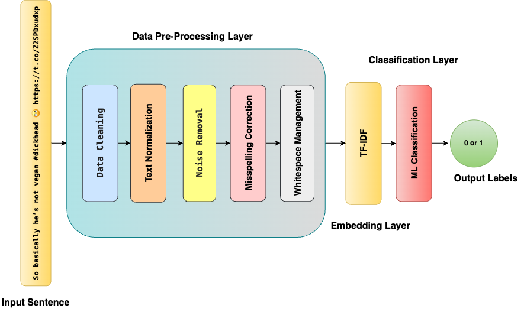
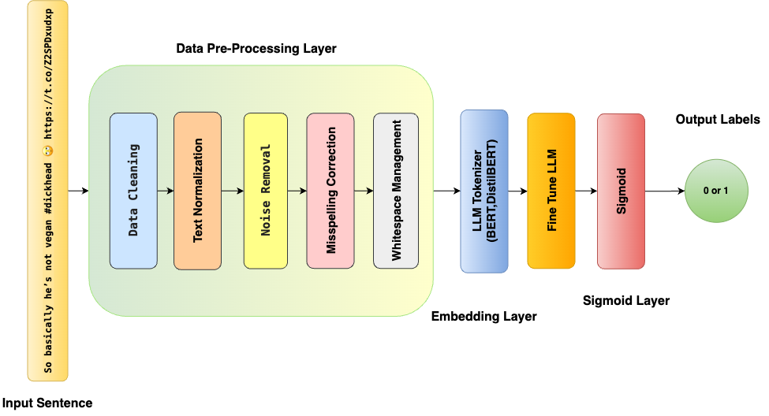

# Project-AI701-G41

This repository contains resources, code, and models for multilingual hate speech detection using both Traditional Machine Learning (ML) methods and Large Language Models (LLMs). The datasets and code are structured to facilitate experimentation and evaluation for English, Hindi, and German languages.

---

## Pipelines

### Traditional ML Pipeline



### LLM Pipeline



---

## Repository Structure

The repository is organized as follows:

### 1. `Dataset` Directory

This directory contains datasets for hate speech detection in three languages: **English**, **Hindi**, and **German**. Each dataset is stored in its respective subdirectory:

- `Dataset/english_dataset`: Contains dataset files for English.
- `Dataset/hindi_dataset`: Contains dataset files for Hindi.
- `Dataset/german_dataset`: Contains dataset files for German.

### 2. `Traditional_ML_Models` Directory

This directory includes implementations of Traditional Machine Learning models for each language. Each language directory contains the following:

- A Jupyter Notebook with code for preprocessing, training, and evaluation.
- Saved ML models for reuse.

Subdirectories:

- `Traditional_ML_Models/English`: Contains code and models for English.
- `Traditional_ML_Models/Hindi`: Contains code and models for Hindi.
- `Traditional_ML_Models/German`: Contains code and models for German.

### 3. `LLMs` Directory

This directory includes implementations of Large Language Models (LLMs) for hate speech detection. Each language has its own subdirectory containing:

- A Jupyter Notebook with code for model fine-tuning and evaluation.
- Model weights are not stored directly in the repository but are available at the following [Google Drive location](https://drive.google.com/drive/folders/1qxuv-IRUKcmFs2TYAt6P3oO29bRVHWo7?usp=sharing).

Subdirectories:

- `LLMs/English`: Contains code and Drive link for English model weights.
- `LLMs/Hindi`: Contains code and Drive link for Hindi model weights.
- `LLMs/German`: Contains code and Drive link for German model weights.

---

## How to Use

### Step 1: Clone the Repository

```bash
git clone https://github.com/SarfrazAhmad307/Project-AI701-G41.git
cd Project-AI701-G41
```

### Step 2: Access Datasets

Navigate to the `Dataset` directory to access datasets for English, Hindi, and German.

### Step 3: Run Traditional ML Models

Navigate to the `Traditional_ML_Models` directory.
Open the notebook for your target language.
Run the notebook to preprocess data, train, and evaluate models.

### Step 4: Run LLM Models

Navigate to the LLMs directory.
Open the notebook for your target language.
Access model weights via Google Drive.
Fine-tune or evaluate the model as per the notebook's instructions.

## Requirements

### Python Version

Python 3.8 or later

### Required Libraries

The following libraries are required to run the notebooks:

- `re`
- `string`
- `emoji`
- `pandas`
- `nltk`
- `stopwordsiso`
- `BeautifulSoup` (from `bs4`)
- `sklearn`
- `wordcloud`
- `matplotlib`
- `seaborn`
- `numpy`
- `transformers`
- `torch`
- `pickle`
- `tqdm`
- `warnings`
- `gc`
- `os`
- `requests`

### Install Dependencies

Install all required libraries using the following command:

```bash
pip install -r requirements.txt
```
